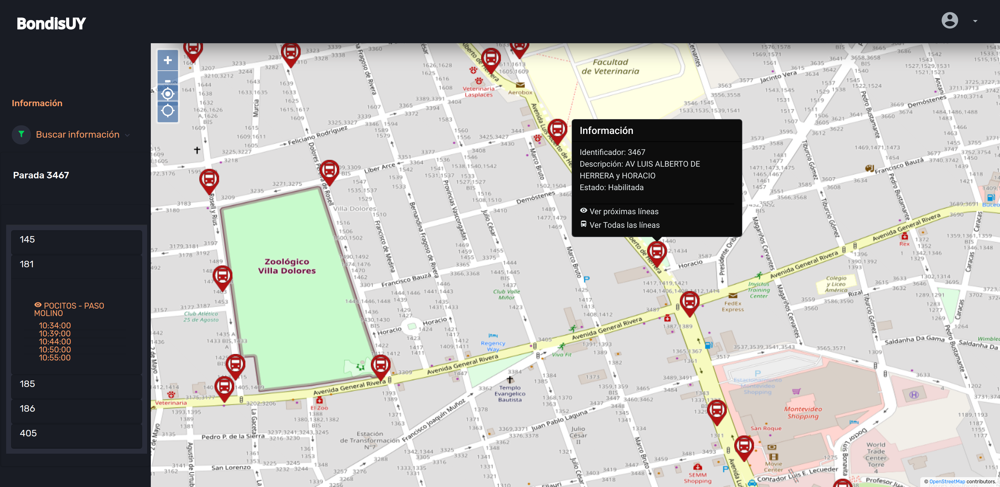
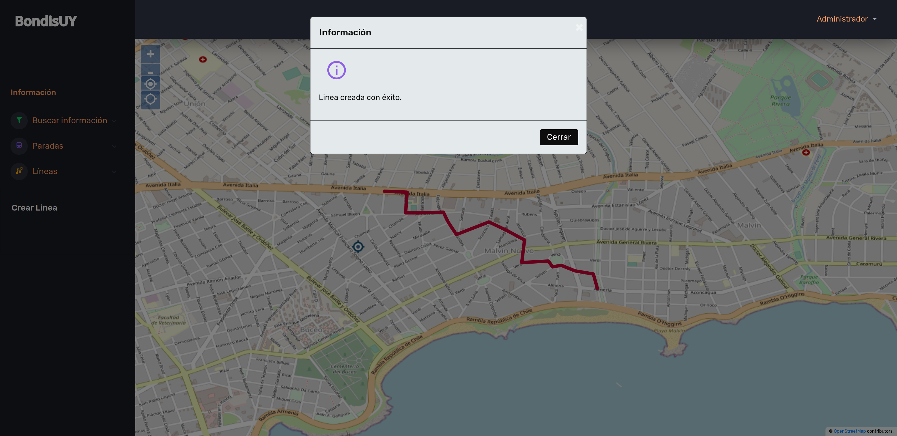

# BondisUY

Laboratorio para la asignatura Taller de Sistemas de Información Geográficos Empresariales de la Facultad de Ingeniería (Fing-UdelaR).

[BondisUY - ElasticCloud](https://bondisuy.web.elasticloud.uy/bondisuy-web/Bondisuy)

## Contenido
1. [Descripción](#descripción)
2. [Despliegue](#despliegue)
	- [Local con aplicaciones instaladas](#local-con-aplicaciones-instaladas)
	- [Con Docker-Compose](#con-docker-compose)
	- [Publicación de capas en Geoserver](#publicación-de-capas-en-geoserver)
3. [Datos de prueba](#datos-de-prueba)
4. [Screenshots](#screenshots)
5. [Tecnologías](#tecnologías)

## Descripción

BondisUY es un sistema georeferenciado con información de paradas, líneas, horarios y sus recorridos. Permite tanto consultar dicha información en tiempo real por usuarios anónimos, como también actualizarla por parte de administradores.

La herramienta provee un mapa con información para el usuario final del transporte público, pudiendo realizar filtros para buscar recorridos, líneas o paradas que cumplan ciertas condiciones.

Más información en el paper del proyecto: Documentacion/Grupo11_BondisUY.pdf.pdf

## Despliegue

### Local con aplicaciones instaladas 

Para poder correr localmente la aplicación BondisUY se debe instalar en el equipo local las siguientes aplicaciones y herramientas: 
- JDK v11 
- PostgreSQL v13 con extensión PostGIS v3.0.3 
- Wildfly v21.0.0

Una vez instaladas estas herramientas, se debe descargar y colocar el binario del Geoserver v2.19.0 en la carpeta de deployments del Wildfly, junto con el binario de la aplicación BondisUY, llamado "bondisuy.ear", ubicado en la ruta JavaEE/bondisuy/bondisuy-ear/target/bondisuy.ear. Esto permitirá que tanto el Geoserver como la aplicación en cuestión sean desplegados por el servidor de aplicaciones. 

Luego, se debe iniciar Postgres con Postgis, crear la base de datos, y cargarle la información que utilizamos del SIG de la Intendencia de Montevideo. Para realizar eso, se debe ejecutar los siguientes scripts SQL ubicados en: /Users/andor/Desktop/Temporal/Git-Eclipse/Recursos/Windows 

1. armadobase.sql Para crear la estructura de la base de datos. 
2. lineas.sql
3. paradas.sql
4. recorridos.sql
5. horarios.sql 

Una vez creada la base de datos y cargada con la información necesaria, se debe levantar Wildfly. Al levantar Wildfly, y desplegar la aplicación BondisUY, junto a Geoserver, se puede acceder a los mismos a través de las siguientes URLs: 

- http://localhost:8080/geoserver/index.html (Geoserver)
- http://localhost:8080/bondisuy-web/Bondisuy (BondisUY) 

A continuación, se deberá publicar las capas necesarias en Geoserver, de forma de que la aplicación pueda acceder a las mismas para cumplir con sus funcionalidades. [Ver sección de publicación de capas en Geoserver](#publicación-de-capas-en-geoserver).

 
### Despliegue con Docker-Compose

Para desplegar el ambiente con Docker, hay que entrar a la carpeta Docker-Compose y una vez dentro, ejecutar el comando: 
```sh
docker-compose up
```

Esto permite levantar contenedores de Wildfly y Postgres (con Postgis) con todo configurado, pero no con las capas de Geoserver publicadas, ya que no logramos automatizar eso todavía. La publicación de dichas capas debe hacerse manualmente.

La carga de datos sí se logró automatizar, a partir de la información que trae el SIG de la intendencia de Montevideo. Por ende, el proceso de despliegue puede demorar dado que ejecuta automáticamente los scripts sql que normalmente habría que correr manualmente.

### Publicación de capas en Geoserver

Acceder a Geoserver, a partir del enlace ya mencionado. Ir a Workspaces y crear uno denominado "bondisuy", con la URI correspondiente, utilizando la IP asignada al equipo local y no localhost. Ejemplo: http://192.168.0.15/tsig 

Luego, ir a Stores y crear uno, a partir de Postgis, también teniendo en cuenta de utilizar la IP local y no localhost.

Ingresar en Data Source Name: bondisuy

Indicar el puerto del motor de base de datos. Es decir, 5432 para Postgres. La base de datos se llama "tsig", y las credenciales de la base de datos son: 
- usuario: postgis 
- contraseña: postgis

Marcar el checkbox para exponer las primary keys.

El paso siguiente es publicar las capas. En este caso, sólo es necesario publicar a partir de Postgres la capa ft_paradas, y luego se debe publicar otras capas, pero a partir de vistas SQL. 

Las capas a publicar a partir de vistas SQL son: 

- ft_recorridolinea 
- ft_lineaubicacion 
- ft_recorridoparadas 
- ft_recorridoszona

La información para publicar las mismas se puede encontrar en: Recursos/CapasSQLGEOSEREVER.txt

## Datos de prueba
Usuario por defecto en backoffice:

- Usuario: admin / Contraseña: 1234

## Screenshots





## Tecnologías

- JakartaEE
- PostgreSQL con PostGIS
- JSP
- Jquery
- Ajax
- Bootstrap
- OpenLayers
